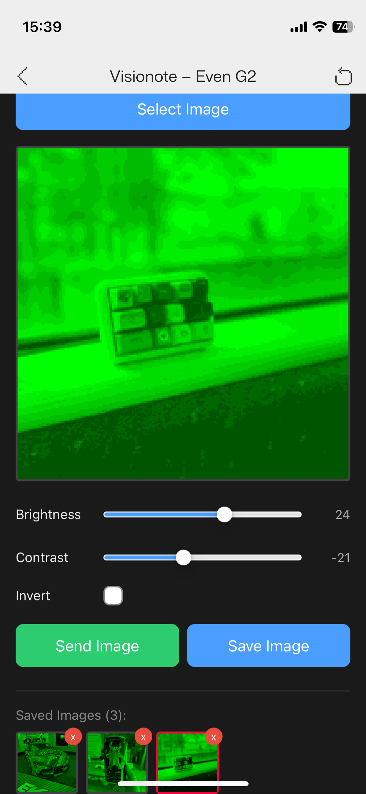
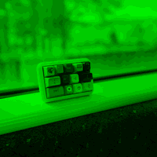

# Visionote

An image viewer app for [Even Realities G2](https://www.evenrealities.com/) smart glasses.

Load any image from your phone, adjust position/rotation/brightness/contrast, and display it on the G2's green 4-bit greyscale screen. Save multiple images and switch between them with a scroll gesture on the glasses.

## Screenshots

| App UI | G2 Preview |
|--------|------------|
|  |  |

## How It Works

Images are processed through the following pipeline:

1. Load image from phone camera roll
2. Pan, pinch-zoom, and two-finger rotate to frame the shot
3. Convert to greyscale → quantize to 16 shades (4-bit)
4. Split into two 200x100 image containers for the G2 display (200x200 total)
5. Encode as 8-bit greyscale PNG and send via Even Hub SDK

The G2 renders images in green (black background + green light), matching how the display actually looks.

## Controls

### Phone UI

- **1-finger drag** — Pan the image
- **2-finger pinch** — Zoom in/out
- **2-finger rotate** — Rotate the image
- **Brightness / Contrast sliders** — Adjust levels
- **Invert toggle** — Invert greyscale
- **Send Image** — Send current edit to G2
- **Save Image** — Save current edit to local storage

### G2 Glasses

| Input | Action |
|-------|--------|
| Scroll up | Next saved image |
| Scroll down | Previous saved image |

## Features

- Touch gestures: pan, pinch zoom, two-finger rotation
- Brightness, contrast, and invert adjustments
- Real-time G2 preview with green 16-shade quantization
- Save multiple processed images to localStorage (base64 encoded)
- Scroll through saved images on G2
- Auto-restore last selected image on reconnect
- UI lock during image send/switch operations

## Getting Started

### Prerequisites

- [Node.js](https://nodejs.org/) (v20+)
- Even Realities G2 glasses (or the [evenhub-simulator](https://www.npmjs.com/package/@evenrealities/evenhub-simulator))

### Development

```bash
npm install
npm run dev
```

### Connect to Glasses

```bash
npm run qr
```

Scan the displayed QR code with Even G2 to connect.

### Build & Package

```bash
npm run build
npm run pack
```

## Project Structure

```
├── g2/
│   ├── index.ts        # App module definition
│   ├── main.ts         # Bridge connection and entry point
│   ├── app.ts          # Scroll handlers and image switching
│   ├── renderer.ts     # Even Hub SDK container management
│   ├── layout.ts       # Display constants (200x200, split positions)
│   ├── events.ts       # Event resolution and dispatch
│   └── state.ts        # Bridge state
├── src/
│   ├── main.ts         # UI wiring and boot sequence
│   ├── image-editor.ts # Image processing, gestures, save/load
│   └── styles.css      # Mobile-first dark theme
├── _shared/
│   ├── app-types.ts    # Shared type definitions
│   └── log.ts          # Logging utility
├── index.html          # Entry point
├── app.json            # Even Hub app manifest
├── vite.config.ts      # Vite config
└── package.json
```

## Architecture

The app uses 3 of the G2's 4 container slots:

| Container | ID | Type | Purpose |
|-----------|----|------|---------|
| evt | 1 | text | Event capture (scroll/tap detection) |
| img-top | 2 | image | Upper half of 200x200 image (200x100) |
| img-btm | 3 | image | Lower half of 200x200 image (200x100) |

Image containers are limited to 200x100 max, so a 200x200 display is achieved by stacking two image containers vertically. The text container is required for event capture (`isEventCapture`).

## Tech Stack

- [TypeScript](https://www.typescriptlang.org/)
- [Vite](https://vitejs.dev/)
- [Even Hub SDK](https://www.npmjs.com/package/@evenrealities/even_hub_sdk) (`@evenrealities/even_hub_sdk`)
