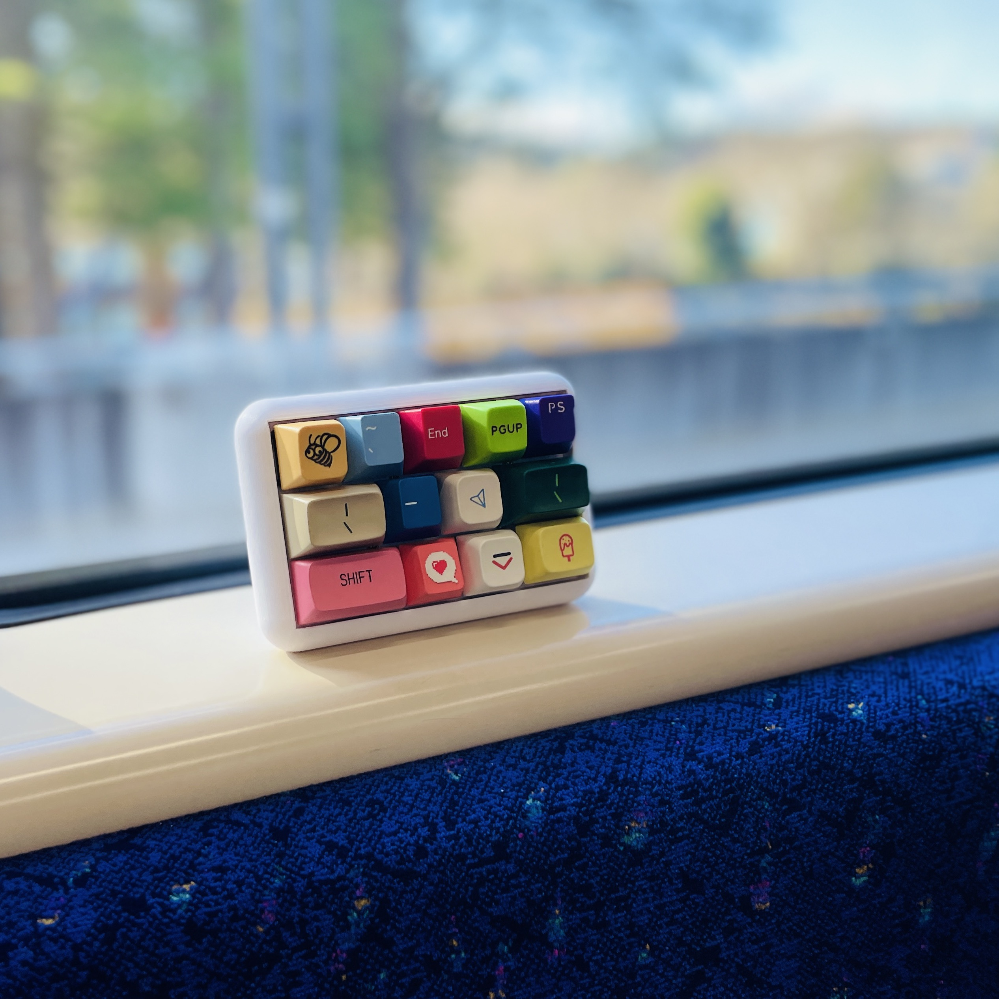

# Visionote

[Even Realities G2](https://www.evenrealities.com/) スマートグラス向けの画像ビューアアプリ。

スマホから画像を読み込み、位置・回転・明るさ・コントラストを調整して、G2の緑色4bitグレースケール画面に表示する。複数の画像を保存し、グラス上でスクロール操作で切り替えることができる。

 → 

## インストール

Even G2でQRコードを読み取って接続:


https://takashicompany.github.io/visionote/

## 仕組み

画像は以下のパイプラインで処理される:

1. スマホのカメラロールから画像を読み込み
2. パン・ピンチズーム・2本指回転で構図を調整
3. グレースケール変換 → 16階調（4bit）に量子化
4. G2ディスプレイ用に200x100の画像コンテナ2枚に分割（合計200x200）
5. 8bitグレースケールPNGにエンコードしてEven Hub SDK経由で送信

G2は緑色（黒背景＋緑発光）で画像を表示する。プレビューも実機と同じ見た目になる。

## 操作方法

### スマホUI


- **1本指ドラッグ** — 画像の移動
- **2本指ピンチ** — ズームイン・アウト
- **2本指回転** — 画像の回転
- **Brightness / Contrastスライダー** — 明るさ・コントラスト調整
- **Invertトグル** — グレースケール反転
- **Send Image** — 現在の編集内容をG2に送信
- **Save Image** — 現在の編集内容をローカルに保存

### G2グラス

| 入力 | アクション |
|------|-----------|
| スクロール上 | 次の保存画像 |
| スクロール下 | 前の保存画像 |

## 特徴

- タッチジェスチャー: パン、ピンチズーム、2本指回転
- 明るさ・コントラスト・反転の調整
- 緑色16階調のリアルタイムG2プレビュー
- 複数の加工済み画像をlocalStorageに保存（base64エンコード）
- G2上でスクロールによる画像切り替え
- 再接続時に最後に選択した画像を自動復元
- 送信・切り替え中のUIロック

## 開発

### 必要なもの

- [Node.js](https://nodejs.org/) (v20+)
- Even Realities G2 グラス（または [evenhub-simulator](https://www.npmjs.com/package/@evenrealities/evenhub-simulator)）

### 開発サーバー

```bash
npm install
npm run dev
```

### グラスとの接続

```bash
npm run qr
```

表示されたQRコードをEven G2で読み取って接続。

### ビルド・パッケージ

```bash
npm run build
npm run pack
```

## プロジェクト構成

```
├── g2/
│   ├── index.ts        # アプリモジュール定義
│   ├── main.ts         # ブリッジ接続とエントリポイント
│   ├── app.ts          # スクロールハンドラと画像切り替え
│   ├── renderer.ts     # Even Hub SDK コンテナ管理
│   ├── layout.ts       # 表示定数（200x200、分割位置）
│   ├── events.ts       # イベント解決とディスパッチ
│   └── state.ts        # ブリッジ状態
├── src/
│   ├── main.ts         # UI配線とブートシーケンス
│   ├── image-editor.ts # 画像処理、ジェスチャー、保存・読込
│   └── styles.css      # モバイルファーストのダークテーマ
├── _shared/
│   ├── app-types.ts    # 共有型定義
│   └── log.ts          # ログユーティリティ
├── index.html          # エントリポイント
├── app.json            # Even Hub アプリマニフェスト
├── vite.config.ts      # Vite設定
└── package.json
```

## アーキテクチャ

G2の4コンテナスロットのうち3つを使用:

| コンテナ | ID | 種別 | 用途 |
|---------|-----|------|------|
| evt | 1 | text | イベントキャプチャ（スクロール・タップ検出） |
| img-top | 2 | image | 200x200画像の上半分（200x100） |
| img-btm | 3 | image | 200x200画像の下半分（200x100） |

画像コンテナの上限は200x100のため、2つの画像コンテナを縦に並べて200x200の表示を実現している。テキストコンテナはイベントキャプチャ（`isEventCapture`）に必要。

## 技術スタック

- [TypeScript](https://www.typescriptlang.org/)
- [Vite](https://vitejs.dev/)
- [Even Hub SDK](https://www.npmjs.com/package/@evenrealities/even_hub_sdk) (`@evenrealities/even_hub_sdk`)
